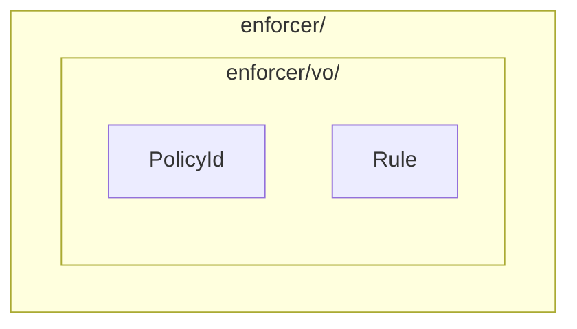

# Architecture HTML Tools

**Audience**: Authors of `architecture.md` files that follow the backend architecture template.

## WHAT

Two Python 3 scripts and a stylesheet, with no dependencies beyond the standard library:

| File | Purpose |
|---|---|
| `build_architecture_html.py` | Renders an `architecture.md` to one self-contained HTML page, with drawn diagrams, tabs and a sidebar |
| `check_html_parity.py` | Fails when the HTML and the Markdown differ in headings, paragraphs, list items, table cells or diagram text |
| `theme.css` | The stylesheet, taken from the `vmruntime` ADR 033 page so that generated pages share one look |

## WHY

Every repository that documents its architecture needs the same Markdown-to-HTML step and the same check that
the two files agree. One copy here avoids each repository keeping its own, and the copies drifting apart.

## HOW

Run both scripts from the repository that owns the document, giving the path to this directory:

```
python <template-engine>/tools/architecture-html/build_architecture_html.py scm/docs/3-design/architecture.md scm/docs/3-design/architecture.html
python <template-engine>/tools/architecture-html/check_html_parity.py scm/docs/3-design/architecture.md scm/docs/3-design/architecture.html
```

Commit the Markdown and the HTML together. The Markdown is the only source.

The header of `build_architecture_html.py` lists the Markdown it supports: headings to level 4, paragraphs, lists,
tables, and three kinds of diagram (`sequenceDiagram`, `classDiagram` and a module-block `flowchart`). A section
with two or more `###` headings is drawn as tabs. The build stops with an assertion when a diagram breaks a
layout rule, such as a box overlapping another or an arrow crossing a box.

The tab and sidebar script needs JavaScript in the browser. Without it every tab's content shows in order.

Shape of a module-block diagram, one outer `subgraph` per module and one inner `subgraph` per kind of type:

````

````

**Status**: no release has been tagged, so repositories cannot pin a version of these tools yet.
